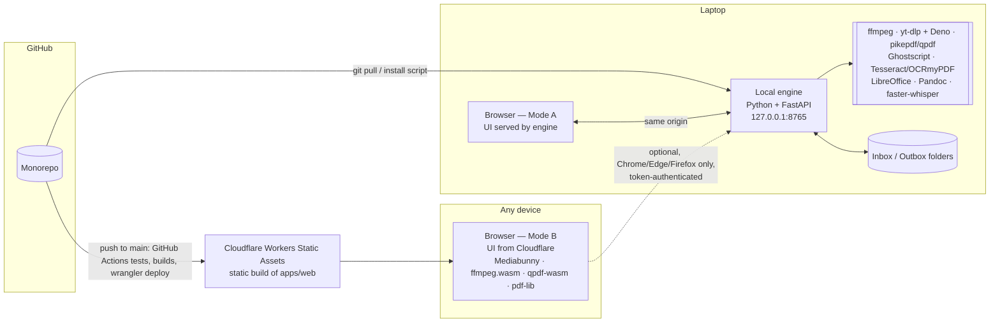

# Werkbank — local-first utilities suite
*Design document, v0.2 — 23 September 2026. "Werkbank" is a placeholder name.*

*v0.2: hosting is an assets-only Cloudflare Worker (Workers Static Assets) deployed from GitHub Actions, replacing the Cloudflare Pages Git integration; Node.js added as a laptop dependency (it builds the UI the engine serves).*

## 1. Summary

A personal toolbox (media download, compression, conversion, PDF utilities, and more) with a web interface, built with Claude Code, versioned on GitHub, and deployable to a free Cloudflare account — while **all file processing happens on your own machine**, never on Cloudflare and never on a third-party converter site.

The central design decision: **one front-end codebase, two ways of running it.**

| Mode | Where the UI comes from | Where the work happens | Use it for |
|---|---|---|---|
| **A — Local (primary)** | Served by the local engine at `http://127.0.0.1:8765` | Native tools on your laptop (ffmpeg, yt-dlp, pikepdf, …) | Everything, including large files and YouTube |
| **B — Hosted (portable)** | Cloudflare Workers Static Assets (`localutilities.cobus-w.workers.dev` or your domain) | Inside the browser (WebAssembly / WebCodecs) | Quick jobs on any device, including phones, with nothing installed |

Mode B can *optionally* hand heavy jobs to the local engine, but only in some browsers (see §2). Mode A has none of those restrictions, which is why it is the primary mode.

## 2. Hard constraints (checked September 2026)

These drive the architecture; each has been verified against current documentation.

1. **Cloudflare cannot do the processing.** Free Workers/Pages Functions are limited to 100 000 requests/day and 10 ms CPU per request, with 128 MB memory per isolate. ffmpeg and yt-dlp cannot run there. Cloudflare's role is *static hosting only*.
2. **25 MiB per-file limit on Cloudflare static hosting** (Workers Static Assets and Pages alike; 20 000 files per version on the free plan; static asset requests are free and unlimited). The ffmpeg.wasm core is roughly 30 MB, so it cannot be bundled into the deployment; it must be lazy-loaded from a CDN or from R2 (free tier 10 GB).
3. **YouTube downloading cannot be done in a browser.** It needs yt-dlp running natively. Since yt-dlp 2025.11.12, full YouTube support also requires an external JavaScript runtime — **Deno** is the default and recommended one — plus the `yt-dlp-ejs` component (bundled with the official executables and with `yt-dlp[default]`). yt-dlp versions older than a few months frequently break against YouTube, so the engine must keep it updated.
4. **A hosted HTTPS page talking to `http://127.0.0.1` is browser-dependent:**
   - **Chrome/Edge 142+**: allowed, but gated behind a *Local Network Access* permission prompt (from Chrome 145 this is the separate `loopback-network` permission). If the user blocks it, the fetch fails.
   - **Firefox**: treats `localhost`/`127.0.0.1` as potentially trustworthy; allowed, no prompt.
   - **Safari (macOS and iOS)**: blocks mixed content, including loopback — Mode B cannot reach the engine.
   - **Same-origin (Mode A)**: none of this applies. This is the main reason the engine serves the UI itself.
5. **ffmpeg.wasm limits:** ~2 GB file ceiling (memory-backed virtual FS), much slower than native ffmpeg, and the multi-threaded build needs `SharedArrayBuffer`, i.e. cross-origin isolation headers (`COOP: same-origin`, `COEP: require-corp` or `credentialless`). The single-threaded build needs no special headers.
6. **Better in-browser media option: Mediabunny** (MPL-2.0, pure TypeScript, zero dependencies). It uses the browser's hardware-accelerated **WebCodecs** API, streams rather than loading whole files into memory, and supports MP4/MOV/WebM/MKV/MP3/WAV/OGG/AAC/FLAC plus H.264, HEVC, VP8/9, AV1 (MP3/AAC/FLAC encoding via optional WASM extensions). Use it first in the browser; fall back to single-threaded ffmpeg.wasm only for formats WebCodecs cannot handle.

## 3. Architecture



### 3.1 Tool registry and routing

Every tool is declared once, in a shared registry used by both the UI and the engine:

```ts
// packages/shared/src/tools.ts
export interface ToolDef {
  id: string;                 // "video.compress"
  title: string;
  category: 'download' | 'video' | 'audio' | 'pdf' | 'image' | 'document' | 'text';
  runsIn: Array<'browser' | 'engine'>;
  params: ParamSchema;        // drives the generated form
  browserLimitBytes?: number; // above this, prefer the engine
}
```

Routing rule in the UI:
1. If the tool is `engine`-only and no engine is reachable → show the tool greyed out with "Start Werkbank on your laptop".
2. If both are possible → use the engine when reachable **or** when the file exceeds `browserLimitBytes`; otherwise run in the browser.
3. The user can override per job ("Run in browser" / "Run on engine").

### 3.2 Job model (engine)

- Single in-process `asyncio` queue; configurable concurrency (default: 1 heavy video job, 3 light jobs).
- Job states: `queued → running → done | failed | cancelled`.
- Progress streamed via **Server-Sent Events**. ffmpeg progress from `-progress pipe:1` (parse `out_time_us` against duration from `ffprobe`); yt-dlp progress via `--progress-template` / `--newline`.
- Every external tool is invoked with an **argument list, never a shell string** (`asyncio.create_subprocess_exec`), so filenames and URLs cannot inject commands.
- Cancel = terminate the process tree and delete partial outputs.

### 3.3 Files

- Browser → engine upload for ordinary files: the file is the raw request body (`POST /api/files?name=…`), streamed straight to disk — no multipart parsing or in-memory buffering. Over loopback this is fast, but it temporarily doubles disk use.
- **Folder mode** for big files: the engine exposes a configurable *Inbox* and *Outbox* (e.g. `~/Werkbank/Inbox`, `~/Werkbank/Outbox`). The UI lists Inbox files; outputs always land in Outbox and are also downloadable.
- Temp work directory per job, deleted on completion; a startup sweep removes anything older than 24 h.
- Output naming: `<original stem> (<tool>).<ext>`, never overwriting — append ` (2)`, ` (3)`.

## 4. Feature catalogue

Phase numbers refer to §9. **E** = engine (native), **B** = browser.

### 4.1 Requested

| Tool | E | B | Phase | Built (registry id) |
|---|---|---|---|---|
| Media downloader (YouTube and other yt-dlp sites) | ✅ | ❌ | 1 | Engine: `download.media` |
| Video compression | ✅ | ✅ (Mediabunny) | 1 / 2 | Engine: `video.compress` |
| Audio compression | ✅ | ✅ | 1 / 2 | Engine: `audio.compress` |
| Audio/video format conversion | ✅ | ✅ | 1 / 2 | Engine: `video.convert`, `audio.convert` |
| PDF password / restriction removal | ✅ (pikepdf) | ✅ (qpdf-wasm) | 1 / 2 | Engine: `pdf.unlock` |

### 4.2 Recommended additions — media

| Tool | Notes | E | B | Phase |
|---|---|---|---|---|
| Trim / cut | "Fast" = stream copy at keyframes (lossless, instant); "Exact" = re-encode | ✅ | ✅ | 2 |
| Extract audio from video | Stream-copy when possible | ✅ | ✅ | 2 |
| Join / concatenate | Concat demuxer when codecs match, else re-encode | ✅ | ⚠️ | 3 |
| Loudness normalisation | EBU R128 `loudnorm`, two-pass, default −16 LUFS (spoken word) | ✅ | ❌ | 2 |
| Noise reduction for recordings | ffmpeg `afftdn` (simple) or `arnndn` (RNNoise model) | ✅ | ❌ | 3 |
| **Transcription** → TXT / SRT / VTT / DOCX | faster-whisper locally; supports English and Afrikaans among others — test quality for other South African languages before relying on it | ✅ | ❌ | 3 |
| Speaker labels (diarisation) | pyannote; needs a Hugging Face token and accepting the model licence — optional | ✅ | ❌ | 4 |
| Subtitles: embed or burn in | Soft-sub into MP4/MKV, or hard-burn | ✅ | ⚠️ | 3 |
| Split long recordings | By duration or detected silence | ✅ | ❌ | 3 |
| Video → GIF / frame grab / thumbnail | `palettegen`/`paletteuse` for decent GIFs | ✅ | ✅ | 4 |
| Speed change, rotate, crop, scale | | ✅ | ✅ | 4 |

### 4.3 Recommended additions — PDF and documents

| Tool | Notes | E | B | Phase |
|---|---|---|---|---|
| Merge / split / reorder / rotate / delete pages | pikepdf (E), pdf-lib (B) | ✅ | ✅ | 2 |
| PDF compression | Ghostscript `-dPDFSETTINGS=/ebook` (lossy images) or qpdf object streams (lossless, modest gain) | ✅ | ⚠️ lossless only | 2 |
| OCR scanned PDFs → searchable PDF | OCRmyPDF + Tesseract, `eng+afr` language packs | ✅ | ❌ | 3 |
| Images → PDF, PDF → images | | ✅ | ✅ | 2 |
| Add password / encrypt PDF | AES-256 | ✅ | ✅ | 2 |
| Strip metadata | PDF info/XMP, image EXIF (incl. GPS), Office document properties | ✅ | ✅ | 2 |
| Office → PDF | LibreOffice headless (`soffice --headless --convert-to pdf`) | ✅ | ❌ | 3 |
| Markdown → DOCX/PDF with citations | Pandoc + `--citeproc` + a CSL style (e.g. Harvard) + a BibTeX/CSL-JSON export from Zotero | ✅ | ❌ | 3 |
| E-book conversion (EPUB ⇄ PDF/DOCX) | Calibre `ebook-convert` | ✅ | ❌ | 4 |

### 4.4 Recommended additions — images and general

| Tool | Notes | E | B | Phase |
|---|---|---|---|---|
| Image convert / resize / compress | Incl. HEIC → JPG; libvips via `pyvips` (E), Canvas/WASM codecs (B) | ✅ | ✅ | 2 |
| QR code generator | Pure browser; SVG + PNG output | — | ✅ | 2 |
| Background removal | `rembg` (downloads a model on first use) | ✅ | ❌ | 4 |
| Checksums (SHA-256), zip/unzip | | ✅ | ✅ | 4 |
| Batch rename | Pattern-based, preview before apply | ✅ | ❌ | 4 |
| Watch-folder automation | Drop a file into `Inbox/<preset>` → processed automatically | ✅ | ❌ | 4 |

### 4.5 Deliberately excluded
- PDF password *cracking* / brute force.
- DRM removal (e-books, streaming services, Adobe/FileOpen-protected PDFs).
- Any cloud processing API.

## 5. Specifications for the four requested tools

### 5.1 Media downloader (engine only)

**Inputs:** URL; mode = *Video* | *Audio only*; quality cap (Best / 1080p / 720p / 480p); container; options.

**Default yt-dlp arguments (video, MP4 for maximum compatibility):**
```
-f "bv*[height<=1080][vcodec^=avc1]+ba[ext=m4a]/bv*[height<=1080]+ba/b[height<=1080]"
--merge-output-format mp4
--embed-metadata --embed-thumbnail --embed-chapters
--windows-filenames
--no-playlist
-o "%(title)s [%(id)s].%(ext)s"
--newline
```
**Audio only:** `-x --audio-format m4a` (default; no re-encode loss when source is AAC), with MP3/Opus options.

**Options exposed in the UI:**
- Download whole playlist (removes `--no-playlist`; adds `--sleep-requests 1` to be gentle).
- Subtitles: `--write-subs --write-auto-subs --sub-langs "en.*,af.*" --convert-subs srt`.
- Transcript-only (subtitles, no media) — pairs well with the transcription tool.
- SponsorBlock removal (`--sponsorblock-remove sponsor`).
- "Info" button: `yt-dlp -J` to show title, duration, available formats before downloading.

**As built (phase 1):** the format filters use `height<=?N` instead of `height<=N`, so formats whose height is unknown are not rejected; yt-dlp runs as `python -m yt_dlp` from the engine's environment with `--js-runtimes deno:<path>` and `--ffmpeg-location <path>` (a PATH inherited before a winget install may miss both), `--ignore-config`, `--no-mtime`, and the URL after `--`. Not built yet: the "Info" button and the cookies option.

**Maintenance:**
- Engine checks the installed yt-dlp version at start-up; if older than 30 days, it offers a one-click update (`uv pip install -U "yt-dlp[default]"` in the engine's virtual environment). *As built:* the health page shows the release age and an **Update yt-dlp** button (`POST /api/admin/update-ytdlp`); the installer also updates it after syncing from the lockfile; the start scripts use `uv run --no-sync`, because a sync would downgrade yt-dlp to the locked version.
- Health check verifies `deno --version`; if missing, the downloader shows a clear fix-it message.
- Age-restricted/members-only videos need `--cookies-from-browser`. On Windows, cookie extraction from Chromium browsers is unreliable because of Chrome's app-bound cookie encryption; Firefox is the more dependable source. Using account cookies carries some risk of the account being flagged — keep this an explicit, off-by-default option.

### 5.2 Compression

**Video presets (engine, ffmpeg):**

| Preset | Settings |
|---|---|
| Share (small) | Scale to max 720p, H.264 `-crf 28 -preset medium`, AAC 96k, `-movflags +faststart` |
| Balanced | Max 1080p, H.264 `-crf 23`, AAC 128k |
| Archive (smaller, slower) | HEVC `libx265 -crf 26` (or hardware HEVC); note: older devices may not play HEVC |
| Screen recording / lecture | Max 1080p, 15 fps, H.264 `-crf 28`, mono AAC 64k |
| **Target size** | User enters MB; two-pass: `video_kbps = (target_MB × 8192 / duration_s) − audio_kbps`, with a 3 % safety margin |

**Hardware encoders:** at start-up the engine runs `ffmpeg -hide_banner -encoders` and detects `h264_qsv`/`hevc_qsv` (Intel Quick Sync), `h264_nvenc`/`hevc_nvenc` (NVIDIA), `h264_amf` (AMD). Offer "Fast (hardware)" as a toggle; it is much faster but less efficient per MB than x264/x265 at the same quality.

**Audio presets:**

| Preset | Settings |
|---|---|
| Speech (smallest) | Opus 32 kbps mono (`.opus`) — or MP3 64 kbps mono for compatibility |
| Podcast | MP3 96 kbps mono + loudnorm −16 LUFS |
| Music | AAC 192 kbps (`.m4a`) or MP3 VBR `-q:a 2` |

**Browser path (Mode B):** Mediabunny Conversion API with resize + target bitrate; codec chosen via `getFirstEncodableVideoCodec(['avc','hevc','vp9'])`.

### 5.3 Conversion

- **Remux first:** if the source codecs are valid in the target container (e.g. MKV with H.264/AAC → MP4), use `-c copy` — lossless and near-instant. The UI states "No quality loss" when this path is used.
- Otherwise transcode with the Balanced preset.
- Supported targets: video MP4, MKV, WebM, MOV; audio MP3, M4A/AAC, Opus, OGG/Vorbis, FLAC, WAV.
- Batch mode: many files → one target format, processed through the job queue.

### 5.4 PDF unlock

A PDF can have two kinds of password; the tool must tell them apart and explain which one it found.

| Type | What it does | Can we remove it? |
|---|---|---|
| **Owner / permissions password** | File opens, but printing/copying/editing is restricted | Yes — decrypting and re-saving removes the restrictions without knowing the password |
| **User / open password** | File will not open at all | Only if the user types the correct password; we then save an unencrypted copy |

**Engine (pikepdf, which wraps qpdf):**
```python
with pikepdf.open(src, password=pw or "") as pdf:
    pdf.save(dst)          # saved without encryption
```
Using the Python library (rather than the `qpdf` CLI) keeps the password out of the process list.

**Browser:** a WebAssembly build of qpdf (several exist on npm — pick an actively maintained one) running in a Web Worker. Note: pdf-lib cannot decrypt encrypted PDFs, so it is not suitable here.

**UI copy:** a one-line reminder that removing restrictions from documents you do not own may breach the licence under which you received them.

## 6. Local engine

- **Language/runtime:** Python 3.12+, managed with **uv**; FastAPI + Uvicorn. Python is chosen because yt-dlp, pikepdf, OCRmyPDF, faster-whisper and rembg are all Python-native.
- **Bind address:** `127.0.0.1` only — never `0.0.0.0`.
- **Serves:** the built UI (`apps/web/dist`) at `/` and the API at `/api/*`.

### 6.1 API

| Method & path | Purpose |
|---|---|
| `GET /api/health` | Engine version; each dependency's version and availability; hardware encoders (tested by a short encode, in the background); free disk space |
| `POST /api/files?name=…` | Upload (raw body) → `{fileId, name, size}` |
| `GET /api/inbox` | List Inbox files (Inbox-relative names) |
| `POST /api/jobs` | `{tool, params, inputs: [{fileId} \| {inbox} \| {url}]}` → job snapshot |
| `GET /api/jobs`, `GET /api/jobs/{id}` | Job snapshots (never include parameters, so never a password) |
| `GET /api/jobs/{id}/events` | SSE stream of job snapshots until the job finishes (read with `fetch`, so the token can be sent) |
| `GET /api/jobs/{id}/outputs/{n}` | Download one output (each output is a separate file in the Outbox; no zip) |
| `POST /api/jobs/{id}/outputs/{n}/reveal` | Show the output in Explorer / Finder |
| `DELETE /api/jobs/{id}` | Cancel (kills the process tree; nothing is written to the Outbox) |
| `POST /api/admin/update-ytdlp` | Update yt-dlp in the venv |

### 6.2 Security (the engine can run programs, so this matters)

- Random 32-byte **token** generated on first run and stored in the engine's config file. Every API call requires `Authorization: Bearer <token>`.
  - Mode A: the engine injects the token into `index.html` when serving it.
  - Mode B: the user pastes the token once into Settings (kept in `localStorage`).
- **Origin allow-list:** `http://127.0.0.1:8765`, `http://localhost:8765`, and your Cloudflare domain. Reject everything else, including requests with no `Origin` on state-changing endpoints.
- **Host header check** (only `127.0.0.1:8765` / `localhost:8765`) to block DNS-rebinding attacks.
- Inputs restricted to uploaded files, the Inbox, or URLs; no arbitrary filesystem paths from the client.
- Subprocesses via argument lists only; strict validation of every parameter against the tool's schema (enums, numeric ranges).
- No telemetry; logs stay local and are rotated.

### 6.3 Dependencies (Windows first; macOS/Linux via Homebrew/apt)

Installed by `scripts/install.ps1` with **winget** — the script must verify each package ID with `winget search` before use:

| Dependency | Needed for | Required? |
|---|---|---|
| uv | Python environment | Yes |
| Node.js (LTS, ≥ 22) | Building the UI that the engine serves (`npm run build -w apps/web`) | Yes |
| FFmpeg (full build, e.g. Gyan's) | All media | Yes |
| Deno | yt-dlp YouTube support | Yes, for downloader |
| Ghostscript | PDF compression | Phase 2 — **not in winget** (`ArtifexSoftware.GhostScript` was removed in September 2025): install from ghostscript.com; decide in Phase 2 whether the installer downloads it (with checksum) |
| Tesseract (+ `afr` language data) | OCR | Phase 3 |
| LibreOffice | Office → PDF | Phase 3 |
| Pandoc | Markdown → DOCX | Phase 3 |
| Calibre | E-books | Phase 4 |

Python packages (`engine/pyproject.toml`): `fastapi`, `uvicorn`, `yt-dlp[default]`, `pikepdf`, `pyvips` (or `Pillow` + `pillow-heif`), `ocrmypdf`, `faster-whisper`, `sse-starlette`, `pydantic`.

`/api/health` reports each as present/missing, and the UI disables dependent tools with a precise fix-it message rather than failing mid-job.

### 6.4 Starting the engine

- Phase 0/1: `scripts\start.cmd` (the installer puts a **Werkbank** shortcut to it on the desktop) → starts the engine and opens `http://127.0.0.1:8765`; if the engine is already running it only opens the browser.
- Later: a system-tray icon (pystray) with Start/Stop/Open/Update, optionally started at login.

## 7. Front end

- **Stack:** Vite + React + TypeScript (the combination Claude Code handles most reliably), Tailwind for styling. No server-side rendering — a pure static build.
- **Layout:** left rail of categories; tool pages generated from the registry's parameter schema; a persistent **Jobs** drawer with progress bars, cancel, and "Open output".
- **Engine indicator** in the header: 🟢 connected (version) / ⚪ browser-only / 🔴 engine found but a dependency is missing.
- **Heavy browser work in Web Workers** so the UI never freezes; Mediabunny and PDF libraries are lazy-loaded per tool, so the first page load stays small.
- **Drag-and-drop** everywhere; multi-file batches.
- **Saving:** standard downloads; in Chrome/Edge, optionally the File System Access API to write a whole batch to a chosen folder.
- **Offline:** a service worker caches the app shell and the WASM modules once used, so Mode B keeps working without a connection.
- Written in South African English (colour, normalise, licence).

## 8. Repository and deployment

```
werkbank/
├─ CLAUDE.md                 # conventions for Claude Code
├─ DESIGN.md                 # this document
├─ apps/web/                 # React UI (built for both modes)
│  ├─ public/_headers        # Cloudflare headers (see below)
│  └─ src/{tools,workers,components,engine-client}
├─ packages/shared/          # tool registry + param schemas (TS) → JSON for the engine
├─ engine/
│  ├─ pyproject.toml
│  └─ werkbank_engine/{main.py,jobs.py,security.py,tools/…}
├─ scripts/{install.ps1,install.sh,start.cmd,start.sh}
├─ wrangler.jsonc            # Cloudflare Workers Static Assets config
└─ .github/workflows/ci.yml  # lint + tests for web and engine; deploys main when green
```

- The tool registry is authored once in TypeScript and exported to `packages/shared/dist/tools.json`, which the engine reads — one source of truth.
- **Never commit binaries** (ffmpeg, wasm cores, models). They come from package managers or CDNs.
- **GitHub:** public or private both work; deployment runs from GitHub Actions, so Cloudflare needs no access to the repository.
- **Cloudflare hosting:** an assets-only Worker (*Workers Static Assets*, no Worker script) configured in `wrangler.jsonc`, serving `apps/web/dist` with single-page-application fallback. Static asset requests are free and unlimited.
- **Deployment:** `.github/workflows/ci.yml` runs lint, type checks, unit tests and end-to-end tests on every push; on `main` only, and only when all of them pass, it builds and runs `npx wrangler deploy` (Wrangler pinned in the lockfile), then checks that the live `/version.json` reports the pushed commit. Needs the repository secret `CLOUDFLARE_API_TOKEN` ("Edit Cloudflare Workers" token). Cloudflare's own Git integration (Workers Builds / Pages) is **not** used: its branch settings could not be managed reliably from the dashboard.
- **`_headers`:** add cross-origin isolation (`Cross-Origin-Opener-Policy: same-origin`, `Cross-Origin-Embedder-Policy: credentialless`) **only if** the multi-threaded ffmpeg.wasm build is adopted. These headers can break cross-origin resources, so leave them off until needed.
- **Large WASM files** (ffmpeg core ~30 MB): load from jsDelivr/unpkg pinned to an exact version with Subresource Integrity, or upload to an R2 bucket.
- **Optional:** put the hosted site behind Cloudflare Access so only you can open it. Not strictly necessary — the hosted page contains no secrets, and the engine token is never in it.

## 9. Build phases (each ends with a working, deployable state)

**Phase 0 — Skeleton (½ day of Claude Code sessions)**
- Monorepo, CI, empty tool registry, UI shell with engine indicator.
- Engine with `/api/health`, token + origin + host checks, serves the UI.
- `install.ps1` for uv + FFmpeg + Deno.
- Cloudflare deployment working (Workers Static Assets via GitHub Actions — see §8).
- ✅ Accept when: Mode A opens at `127.0.0.1:8765` showing 🟢 with dependency versions; Mode B loads from Cloudflare showing ⚪.
- *Status (23 Sept 2026): implemented. Verified by CI on every push — Playwright acceptance tests (Mode A 🟢 with versions against the real engine; Mode B ⚪ with the real Cloudflare config), and a real `install.ps1` run on a fresh Windows Server 2025 runner (winget → uv, FFmpeg, Deno; engine started through `start.cmd` reports `ok`). Mode B verified on the live site. Still to confirm: a first install on the owner's own laptop.*

**Phase 1 — The four requested tools on the engine**
- Downloader, video/audio compression presets (incl. target size and hardware toggle), conversion with remux-first, PDF unlock.
- Job queue with SSE progress and cancel.
- ✅ Accept when: a 1 h lecture video compresses with live progress and can be cancelled cleanly; a YouTube video downloads as MP4 and as M4A; an owner-restricted PDF is unlocked without a password and a user-password PDF unlocks only with the correct one.
- *Status (23 Sept 2026): built. Verified in CI through the real UI and engine: live progress over SSE and a clean cancel (40-second clip, not 1 h), remux-first conversion, target-size compression within the target, PDF unlock of both kinds (the password is never echoed back), and yt-dlp downloading from a web server; the engine test suite also runs on Windows. **Not yet verified: YouTube** — YouTube refuses cloud/CI addresses ("Sign in to confirm you're not a bot"), so the MP4/M4A download must be confirmed on the owner's laptop.*

**Phase 2 — Browser path and first additions**
- Mediabunny compression/conversion, qpdf-wasm unlock, pdf-lib page tools, image tools, QR codes, metadata stripping, loudness normalisation, trim/extract audio, Ghostscript compression.
- Mode B → engine connection (Chrome/Edge permission flow, Firefox, clear Safari message).
- ✅ Accept when: on a phone, a 50 MB video compresses and a PDF unlocks with nothing installed.

**Phase 3 — Academic workflow tools**
- Transcription (faster-whisper; model size selectable), subtitles, OCR (eng+afr), Office → PDF, Pandoc with citations, noise reduction, split, concat.

**Phase 4 — Comfort**
- Tray app, watch folders, diarisation, background removal, e-books, batch rename, checksums.

## 10. Testing

- **Engine:** pytest with small fixture files (5-second clips in several codecs, PDFs with each encryption type, a scanned page). Snapshot the exact ffmpeg argument lists each preset generates.
- **Security tests:** requests with wrong token, foreign `Origin`, foreign `Host`, path-traversal filenames, shell metacharacters in URLs and filenames — all must be rejected or neutralised.
- **Web:** Vitest for registry/routing logic; Playwright smoke test that runs one browser-side conversion in Chromium and Firefox.
- **yt-dlp:** one opt-in live test (network), not in CI — YouTube changes too often for CI to be stable.

## 11. Legal and ethical notes

- YouTube's Terms of Service prohibit downloading content except where YouTube provides a download option or the rights-holder permits it. Building the tool is fine; *what* you download is your responsibility. Safe uses: your own uploads, Creative Commons material, content you have permission for, and material where South African copyright exceptions (e.g. fair dealing for research or private study) apply — this is not legal advice.
- Keep the hosted site private in spirit: do not advertise a public downloader.
- PDF unlocking: see §5.4.
- Licences: FFmpeg (LGPL/GPL depending on build), Ghostscript (AGPL), yt-dlp (Unlicense), qpdf/pikepdf (Apache-2.0/MPL-2.0), Mediabunny (MPL-2.0). All fine for personal use; they matter only if you ever distribute bundled binaries.

## 12. Alternatives considered

- **Desktop app (Tauri/Electron):** cleaner (no localhost security questions, native file paths), but loses the "open it anywhere from Cloudflare" benefit. Worth revisiting if Mode B turns out to be rarely used — the React UI can be moved into Tauri with little change.
- **Browser-only:** impossible for YouTube; poor for large video and OCR/transcription.
- **Self-hosted server (VPS):** costs money and moves files off your device — contrary to the goals.

## 13. Open decisions

1. Confirm the laptop OS (this design assumes Windows 11) and whether the GPU/CPU offers hardware encoding.
2. React vs Svelte (React recommended for Claude Code reliability).
3. Whether Mode B needs engine access at all, or should stay browser-only (simpler and safer).
4. Default transcription model size (speed vs accuracy trade-off on your hardware).
